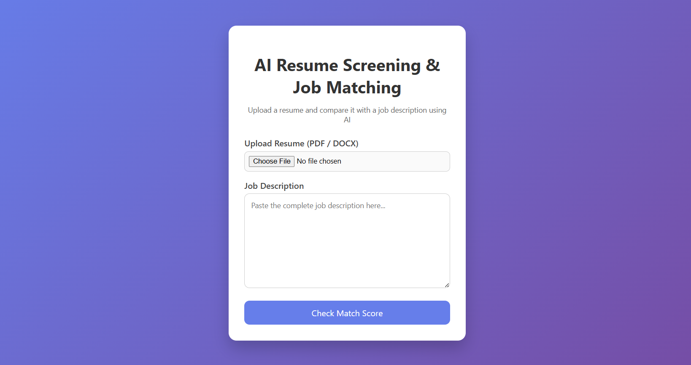
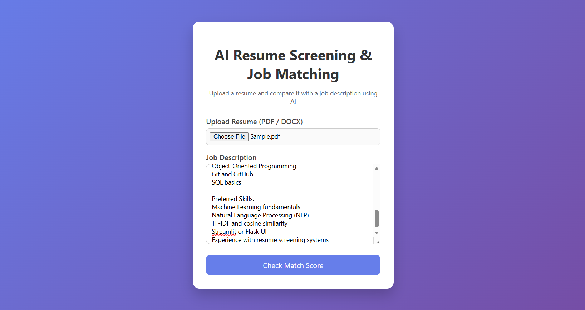
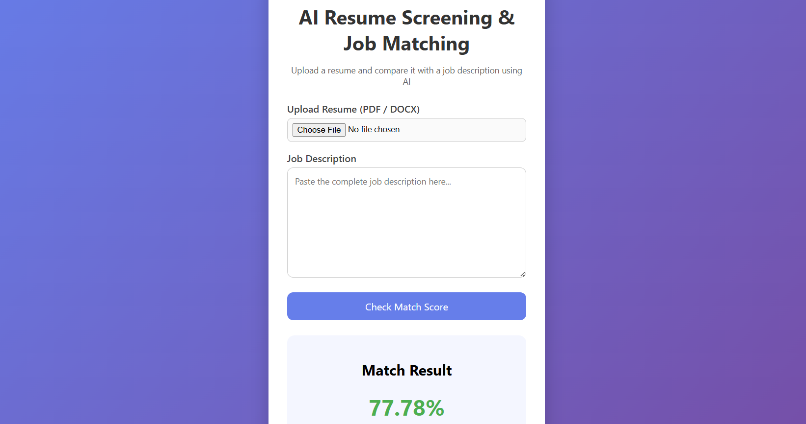

# AI Resume Screening & Job Matching System

An AI-powered web application that analyzes a resume against a job description and calculates a match percentage using NLP and machine learning techniques.

## Features

- Upload resumes in PDF or DOCX format
- Enter a job description
- Extract text from PDF and DOCX files
- Text preprocessing using NLTK
- TF-IDF based feature extraction
- Cosine similarity for resume-job matching
- Match percentage calculation
- Candidate match categories:
  - Great Match (>= 85%)
  - Good Match (>= 70%)
  - Average Match (>= 40%)
  - Poor Match (< 40%)
- Simple and user-friendly web interface

## Demo

### Home Page



### Resume Upload



### Result



## Tech Stack

- Python
- Flask
- NLTK
- Scikit-learn
- PyPDF2
- python-docx
- HTML
- CSS

## How It Works

1. User uploads a resume and enters a job description.
2. Resume text is extracted from the uploaded PDF or DOCX file.
3. Text is cleaned and normalized using NLP preprocessing.
4. TF-IDF converts the resume and job description into numerical features.
5. Cosine similarity calculates the similarity score.
6. The application displays the match percentage and match category.

## Project Structure

```text
AI-Resume-Screening-Candidate-Ranking/
│
├── sample_resumes/
├── screenshots/
├── static/
├── templates/
│
├── app.py
├── matcher.py
├── resume_parser.py
├── requirements.txt
├── README.md
└── .gitignore